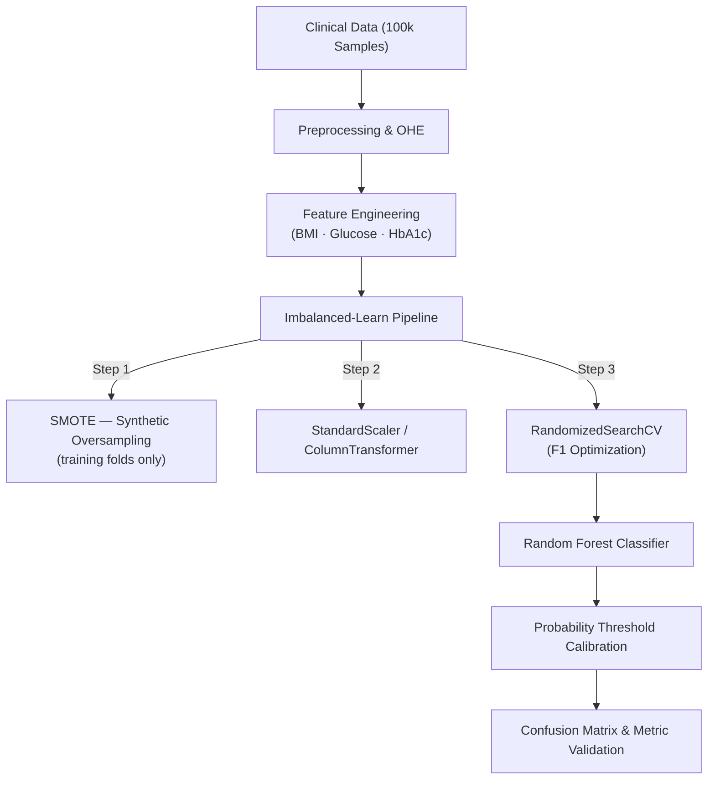

# 🩺 Diabetes Diagnostic Predictor

A machine learning framework for diabetes risk classification on highly imbalanced clinical datasets — optimized for **clinical reliability** over raw accuracy.

---

## 🎯 Highlights

| Metric | Baseline (Recall-Optimized) | Final (F1-Optimized) |
|---|---|---|
| **Precision** | 0.49 | **0.77** |
| **Recall** | 0.86 | 0.75 |
| **F1-Score** | 0.63 | **0.76** |
| **ROC AUC** | 0.972 | **0.969** |
| **False Positive Rate** | ~11% | **2.22%** |

> ✅ **85% reduction in False Positives** — directly addressing clinical "alarm fatigue."

---

## 📖 Overview

Standard classifiers optimizing for accuracy on imbalanced datasets (~9% diabetic rate) produce dangerously misleading results. This project tackles that with a targeted engineering approach:

- **SMOTE within CV folds** — prevents data leakage from synthetic oversampling
- **F1-Score optimization** — shifts from a "wide net" Recall-heavy approach to precision-balanced diagnostics
- **Feature interpretability** — analyzes `HbA1c` and `Blood Glucose` non-linear impact via Random Forest Gini Importance

---

## 🏗️ Pipeline Architecture

---

## 📊 Dataset

**100,000 instances** — ~9% positive class (diabetic).

| Feature | Type | Role |
|---|---|---|
| `HbA1c_level` | `float` | Long-term blood sugar average — **primary predictor** |
| `blood_glucose_level` | `int` | Instantaneous glucose measurement |
| `bmi` | `float` | Body Mass Index |
| `age` | `float` | Non-linear risk multiplier |
| `hypertension` | `binary` | Co-morbidity indicator |

**Target:** `diabetes` (0 / 1)

---

## 🔬 Key Engineering Decisions

### 1. The SMOTE Leakage Fix
Naive SMOTE application before `train_test_split` contaminates validation folds with synthetic samples derived from test data, inflating F1 scores. The fix: wrap SMOTE inside `imblearn.Pipeline` so oversampling occurs **only on training folds** during cross-validation.

### 2. The F1 Pivot
Optimizing `RandomizedSearchCV` for **Recall** produces a model that flags nearly everything — useful for broad screening, but catastrophic in clinical settings where every False Positive triggers costly follow-up. Switching to **F1** as the target metric forced the model to learn a stricter decision boundary, slashing the false positive rate from ~11% to 2.22%.

### 3. Computational Cost Reduction
10-fold CV with SMOTE on 100k rows exceeded 50-minute runtimes. Resolved by:
- Reducing `n_iter` in `RandomizedSearchCV`
- Capping `max_depth` to prune the hyperparameter search space

F1-Score was preserved without degradation.

---

## ⚙️ Technical Challenges

**`SMOTE` `n_jobs` deprecation** — Newer versions of `imbalanced-learn` removed the `n_jobs` parameter from `SMOTE`, causing pipeline crashes. Resolved by delegating parallelism to the `n_jobs` argument at the `RandomizedSearchCV` level instead.

---

## 📈 Model Comparison

| Model | Optimization Target | Precision | Recall | F1-Score | ROC AUC |
|---|---|---|---|---|---|
| **Random Forest** | **F1-Score** | **0.77** | **0.75** | **0.76** | **0.969** |
| Random Forest | Recall | 0.49 | 0.86 | 0.63 | 0.972 |
| Logistic Regression | Baseline | 0.42 | 0.88 | 0.57 | 0.960 |

---

## 🔗 Links

- 📓 **Kaggle Notebook:** [Diabetes Classification Analysis](https://www.kaggle.com/code/ahmedemasha/diabetes-classifcation)
- 📦 **Dataset:** [Diabetes Prediction Dataset](https://www.kaggle.com/datasets/iammustafatz/diabetes-prediction-dataset)
